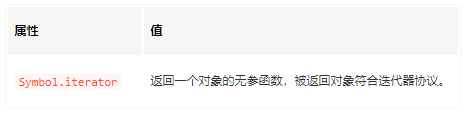
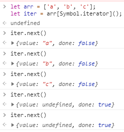

## 变量的解构赋值
ES6允许按照一定模式，从数组和对象中提取值，对变量进行赋值，这被称为解构（Destructuring）。
+ ES6中只要某种数据有Iterator接口（也就是可以循环迭代），都可以进行解构赋值。
+ 数组的解构是按次序排列的，变量取值由位置决定的，而对象的属性是没有顺序的，变量必须与属性同名才能取到正确的值。
解构其内在是针对可迭代对象的Iterator接口，通过遍历器按顺序获取对应的值进行赋值。
        // 基础类型解构
        let [a, b, c] = [1, 2, 3]
        // 对象数组解构
        let [a, b, c] = [{name: '1'}, {name: '2'}, {name: '3'}]
        // ...解构
        let [head, ...tail] = [1, 2, 3, 4]
        // 嵌套解构
        let [a, [b], d] = [1, [2, 3], 4]
        // 解构不成功为undefined
        let [a, b, c] = [1]
        // 解构默认赋值
        let [a = 1, b = 2] = [3]

### 遍历器（Iterator）
Iterator是一种接口，为各种不一样的数据解构提供统一的访问机制。任何数据解构只要有Iterator接口，就能通过遍历操作，依次按顺序处理数据结构内所有成员。ES6中的for of的语法相当于遍历器，会在遍历数据结构时，自动寻找Iterator接口。（ 遍历器对象本质上，就是一个指针对象）
### 可迭代对象
可迭代对象是Iterator接口的实现。它不是内置或语法，而仅仅是协议。任何遵循该协议点对象都能成为可迭代对象。可迭代对象得有两个协议：
+ 可迭代协议:对象必须实现***@@iterator***方法。即对象或其原型链上必须有一个名叫Symbol.iterator的属性。该属性的值为无参函数，函数返回迭代器协议。

+ 迭代器协议:定义了标准的方式来产生一个有限或无限序列值。其要求必须实现一个next()方法，该方法返回对象有done(boolean)和value属性。

通过以上可知，自定义数据结构，只要拥有Iterator接口，并将其部署到自己的Symbol.iterator属性上，就可以成为可迭代对象，能被for of循环遍历。

### 解构语法糖

每一次调用next方法，都会返回数据结构的当前成员的信息。具体来说，就是返回一个包含value和done两个属性的对象。其中，value属性是当前成员的值，done属性是一个布尔值，表示遍历是否结束。
上面代码中，变量arr是一个数组，原生就具有遍历器接口，部署在arr的Symbol.iterator属性上面。所以，调用这个属性，就得到遍历器对象。

        // Array
        let arr = ['a', 'b', 'c'];
        let iter = arr[Symbol.iterator]();

        // 以下等效于 let [first, second, third, four] = ['a', 'b', 'c']
        let first = iter.next() // { value: 'a', done: false }
        let second = iter.next() // { value: 'b', done: false }
        let third = iter.next() // { value: 'c', done: false }
        let four = iter.next() // { value: undefined, done: true }