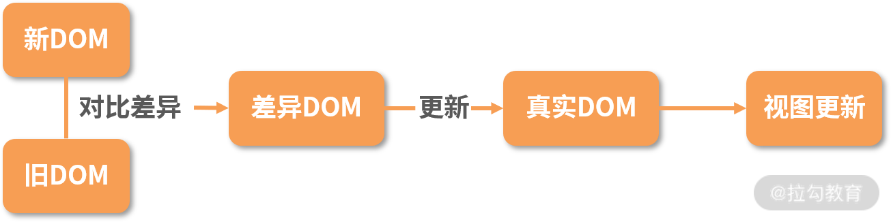
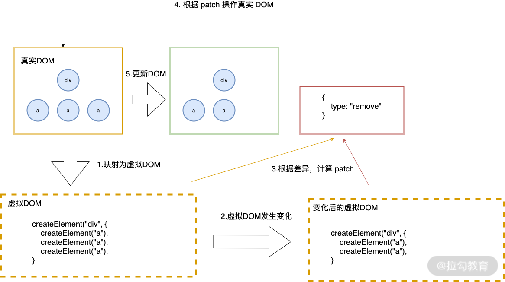

## Diff 算法
#### 是什么
diff 算法探讨的就是虚拟 DOM 树发生变化后，生成 DOM 树更新补丁的方式。它通过对比新旧两株虚拟 DOM 树的变更差异，将更新补丁作用于真实 DOM，以最小成本完成视图更新。触发更新 → 生成补丁 → 应用补丁。
  
#### 具体流程
- 真实DOM与虚拟DOM之间存在一个映射关系。（初始化JSX建立完成）
- 当虚拟DOM发生变化后，会根据差距计算生成patch（结构化数据，包含了增加，更新，移除等）
- 根据patch去更新真实的DOM，展示到界面上。
  

#### 三个点
###### 更新时机
触发更新、进行差异对比的时机。更新发生在setSate、Hooks调用操作以后。此时数的节点发生变化，开始进行对比，那么如何对两棵树对比差异呢?
###### 遍历算法
遍历算法是指沿着某条搜索路线，依次对树的每个节点做访问。通常分为两种：深度优先遍历和广度优先遍历。
- 深度优先遍历：从根节点出发，沿着左子树方向进行纵向遍历，直到找到叶子结点为止。然后回溯到前一个节点，进行右子树节点的遍历，直到遍历完所有可达节点。
- 广度优先遍历：从根节点出发，在横向遍历二叉树层段节点的基础上，纵向遍历二叉树的层次。  

react的diff采用了深度优先遍历算法，因为广度优先可能会导致组件的生命周期时序错乱。
###### 优化策略
传统diff算法存在一个严重的性能瓶颈，其时间复杂度为O(n^3)，n表示树的节点总数。React通过分治思想巧妙的分解了这个问题，具体来说，React分别通过<b>树</b>、<b>组件</b>和<b>元素</b>三个层面进行复杂度的优化，并诞生了与之对应的策略。
- <b>策略一：忽略节点跨层级操作场景，提升对比效率</b>
这一策略需要进行<b>树对比</b>，即对树进行分层比较。两棵树只对同一层次的节点进行比较，当发现节点不存在时，该节点及其子节点都会被删除，不会用于进一步的比较，从而提升效率。
- <b>策略二：如果组件的class一致，则默认为相似的树结构，否则默认为不同的树结构</b>
在组件比对中，如果组件是同一类型的则进行数比对，不是则直接放入补丁中。只要父组件类型不同就会被重新渲染。
- <b>策略三：同一层级的子节点，可以通过标记key的方式进行列表对比</b>
元素比对主要发生在同层级，通过标记<b>节点操作</b>生成补丁。节点操作包含插入、移动、删除等。节点重新排序同时包含这三个操作，效率消耗最大，该策略起到了至关重要的作用。

以上是经典react diff算法内容。
### 引入Fiber架构
为了使整个更新过程可随时暂停和恢复，节点和树分别采用了FiberNode与FiberTree进行重构。通过fiberNode的双链表结构，可以直接找到兄弟节点与子节点